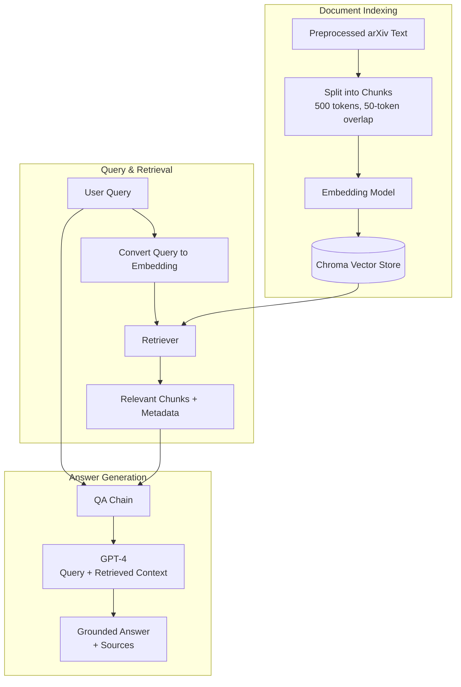
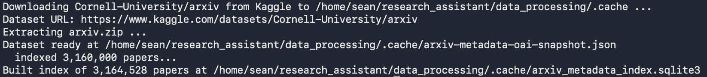
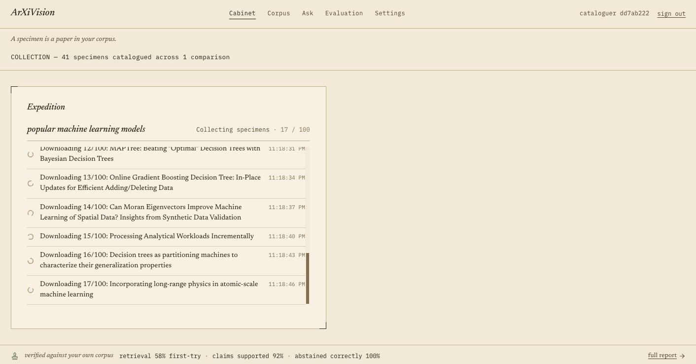
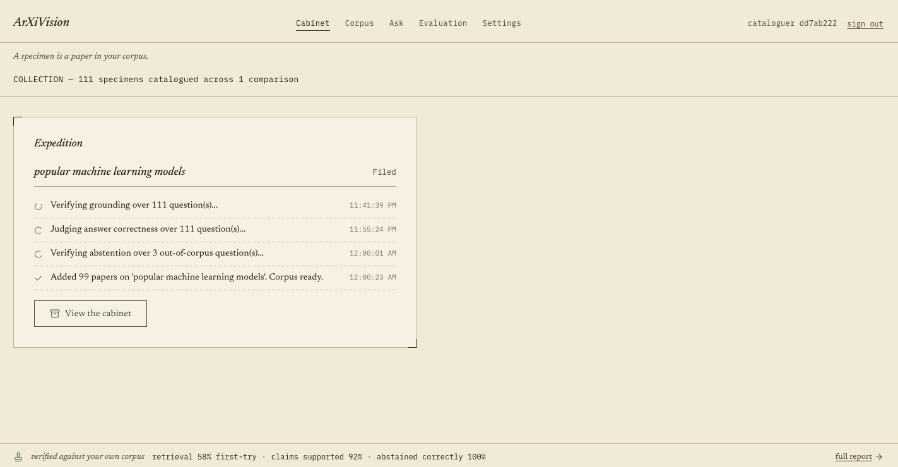

# How to access webpage
- Go to https://research-assistant-bay.vercel.app
- Create new user or enter existing api key to enter

Use key 7dcadf58bd85eb17f6bca7f43c7cd05cd79f841bc6b7930f to view a sample account with 100+ papers.

# Data collection and preprocessing
The purpose of the data scraper is to preprocess and clean data from research papers to prepare for model training.
1. **Paper Collection**\
Research papers are collected from arXiv.org based on a selected topic or category. Paper metadata, such as the title, authors, abstract, publication date, and arXiv ID, is stored alongside each document.
2. **Text Extraction**\
PyMuPDF is used as the primary extraction method because most arXiv PDFs contain embedded text. If the extracted text is missing, corrupted, or of poor quality, Surya OCR is used as a fallback.
3. **Cleaning the data**\
The extracted data is processed to remove:
- HTML artifacts
- dupes using minhash
- PIIs
- repetitive N-grams
4. **Data output**\
Output will be ready for model training in structure JSON format

# RAG component
Performed with preprocessed texts and metadata.

# Evaluation

`evaluate_results.py` scores the system against `evaluation_questions.json`.

**Retrieval** (metadata only, no model calls): Hit@1, Hit@4, paper-level Hit@4, and MRR@4.

**Grounding** (deterministic — parses the answer text and compares it to the chunks that were actually retrieved, so no model can hallucinate its way to a pass):
- *citation validity* — every arXiv ID and page number cited was really retrieved. This catches invented sources.
- *citation correctness* — the cited page is one of the pages that actually contains the answer.
- *numeric grounding* — every figure quoted in the answer appears in the retrieved text. Catches altered statistics.
- *name grounding* — every person named appears in the retrieved text. Catches invented attribution.
- *citation coverage* — how many asserting sentences carry a citation, since the prompt requires one per claim.

**Abstention**: unanswerable questions (marked `"answerable": false`) should be refused, and answerable ones should not be. Both directions are measured, because a system that refuses everything would otherwise score perfectly.

Note on cosine similarity: `RAGClass.evaluate()` compares an embedding of the whole answer to an embedding of the whole ground truth. This measures whether the two are *about the same topic*, not whether the answer is true. An answer that reports a figure as 90% when the paper says 0% will still clear the 0.80 threshold, because almost every word around the number matches. Treat it as a rough smoke test for drift, not as a validity check — the grounding metrics above are the ones that actually detect hallucinated facts and citations.

Sample size note: with a handful of questions, one question is worth double-digit percentage points. Differences between runs are noise until the question set is much larger.

# Model Reliability Note

Smaller or weaker language models may misinterpret retrieved chunks, give too much weight to less relevant evidence, or make claims that are not fully supported by the provided text. RAG reduces hallucination by grounding the model in retrieved sources, but it does not eliminate hallucinations.

Testing has confirmed that models like gpt-nano and deepseek-v4-flash extract data from the wrong chunks. Currently the model is set to use gpt-4. Switched to gpt-5-nano for testing.

# Issues with hit@N
Grounding first in what we actually know, not guesses: paper_hit@4 is 100% every time — the failure is entirely about pinpointing the right page inside a correctly-found paper, and the dominant pattern in the real misses is a concept stated early (often the abstract) and restated at greater length later in the paper, where the elaborated version out-competes the terse original in cosine similarity.

# Version 1
Features that I've implemented so far
- Extracting and cleaning papers from Arxiv
- RAG embeddings, top-N chunks
- Evaluation metrics: retrieval, generation, abstention
- Chroma persist (so that the embeddings stay saved between runs)
- Dataset: 10 PAPERS, 7 question
- GOAL: Scale up to 100, 1000 papers

# Completed improvements/goals
1. Scale number of texts to 100, 500, 1000 without losing accuracy or efficiency
2. Persist Chroma vector database to prevent costly recomputaitons
3. Build working frontend
4. Cross-paper examination
5. Research gap identification: findings, strengths, limitations, stated future work
6. 
# Version 2
Features added since v1
- Full React frontend: dashboard, corpus browser, collections/compare, ask, settings, evaluation report
- Per-user, per-topic isolated corpora - retrieval and collections scoped to one topic at a time
- Configurable LLM settings per user: model choice, temperature, language style
- Background ingest with granular progress and per-stage failure messages; arXiv retry/backoff
- Dynamic per-user evaluation: GPT-5-authored questions generated from each user's own papers, not a fixed benchmark
- Hybrid retrieval (BM25 + embeddings, fused) - measured hit@1 40%→60%, hit@4 60%→100%
- Answer-correctness judge - checks if the answer is actually right, independent of which chunk it came from
- Per-day API usage caps to prevent key abuse
- Dataset: 10 papers, 10 dynamic questions per user
- GOAL: add a reranker for sharper retrieval; scale dataset to 100-1000 papers

# Backend file map
Everything outside `frontend/` is the backend.

- `api.py` — the FastAPI app itself: every route (`/users`, `/ingest`, `/collections`, `/ask`, `/search`, `/evaluation`, `/settings`), auth, CORS, daily rate limits
- `db.py` — SQLite persistence (`data/app.db`): users, collections, jobs, evaluation results
- `ingest.py` — the background "expedition" pipeline: arXiv search → download → extract → embed
- `synthesis.py` — per-collection paper comparison, contradictions/gaps, follow-up suggestions
- `dynamic_eval.py` — generates and scores each user's own verification questions

`rag/` — the retrieval engine:
- `rag_class.py` — `RAGClass`: chunking, hybrid BM25+embeddings retrieval, the QA chain
- `rag_registry.py` — per-user in-memory cache of `RAGClass` instances
- `rag_implementation.py` — loads/validates `OPENAI_API_KEY` from `.env`

`data_processing/` — turning arXiv into usable text:
- `download_arxiv.py` — arXiv search + PDF download, with retry/backoff
- `extract_pdf.py` — PDF → text extraction
- `preprocessing.py` — cleaning (dedup, PII, etc.)

`evaluate/` — the scoring logic used by `dynamic_eval.py`:
- `retrieval.py`, `grounding.py`, `abstention.py`, `correctness.py` — one file per metric family
- `evaluate_results.py` — an older standalone benchmark script, separate from the live per-user flow

### Updating the paper database
These commands are all run on my personal droplet.

Run the two commands to re-fetch Kaggle paper metadata and rebuild the SQLite (backend) index from scratch
python -m data_processing.kaggle_search download
python -m data_processing.kaggle_search build

It's important to keep on updating the database because it's a one-time build and will not continuously update when new papers are added to Arxiv.

Dataset used: "arXiv dataset" by Cornell University, https://www.kaggle.com/datasets/Cornell-University/arxiv
~Takes around 5-10 minutes, indexes 3 M pages.

sudo journalctl -u research_assistant -f
Views the size of the database.

